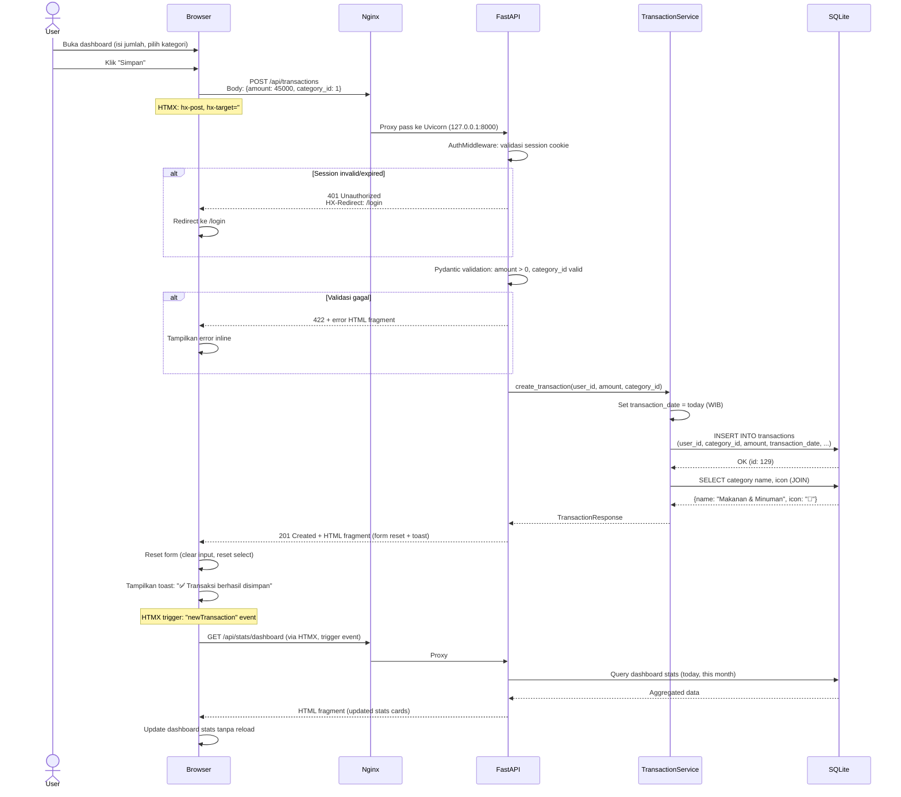
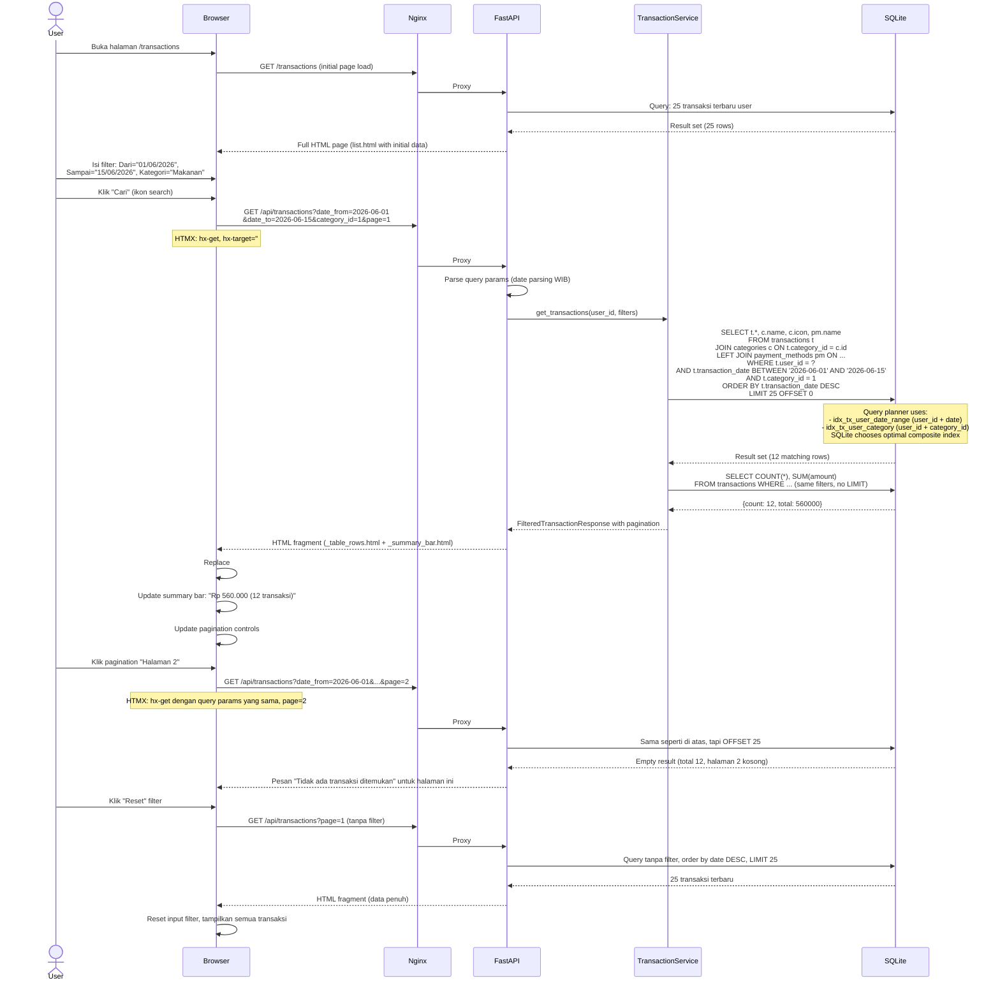

# Dokumen Arsitektur Teknis (Architecture Design Document)

## Aplikasi Web: Pencatatan Pengeluaran Harian ("CatatPeng")

---

**Versi:** 1.0  
**Tanggal:** 15 Juni 2026  
**Target Environment:** VPS 2 Core CPU / 4GB RAM  
**Penulis:** Architect Agent  

---

## Daftar Isi

1. [Ringkasan Eksekutif](#1-ringkasan-eksekutif)
2. [Technology Stack](#2-technology-stack)
   - [2.1 Pemilihan & Justifikasi](#21-pemilihan--justifikasi)
   - [2.2 Stack Final](#22-stack-final)
   - [2.3 Library & Dependensi](#23-library--dependensi)
3. [Database Schema](#3-database-schema)
   - [3.1 Entity-Relationship Diagram (Konseptual)](#31-entity-relationship-diagram-konseptual)
   - [3.2 Tabel `users`](#32-tabel-users)
   - [3.3 Tabel `categories`](#33-tabel-categories)
   - [3.4 Tabel `payment_methods`](#34-tabel-payment_methods)
   - [3.5 Tabel `transactions`](#35-tabel-transactions)
   - [3.6 Strategi Index](#36-strategi-index)
   - [3.7 Seed Data](#37-seed-data)
   - [3.8 Query Plan Analysis](#38-query-plan-analysis)
4. [API Contracts](#4-api-contracts)
   - [4.1 Autentikasi & Otorisasi](#41-autentikasi--otorisasi)
   - [4.2 Modul Auth](#42-modul-auth)
   - [4.3 Modul Transaksi](#43-modul-transaksi)
   - [4.4 Modul Kategori](#44-modul-kategori)
   - [4.5 Modul Metode Pembayaran](#45-modul-metode-pembayaran)
   - [4.6 Modul Statistik & Dashboard](#46-modul-statistik--dashboard)
   - [4.7 Modul Export](#47-modul-export)
   - [4.8 Page Routes (HTML)](#48-page-routes-html)
5. [Struktur Proyek](#5-struktur-proyek)
   - [5.1 Backend — Python / FastAPI](#51-backend--python--fastapi)
   - [5.2 Frontend — Jinja2 Templates](#52-frontend--jinja2-templates)
6. [Sequence Diagram](#6-sequence-diagram)
   - [6.1 Quick-Add Transaksi dari Dashboard](#61-quick-add-transaksi-dari-dashboard)
   - [6.2 Filter dan Lihat Riwayat](#62-filter-dan-lihat-riwayat)
7. [Data Flow Arsitektur](#7-data-flow-arsitektur)
   - [7.1 Diagram Alur Data](#71-diagram-alur-data)
   - [7.2 Penjelasan Setiap Lapisan](#72-penjelasan-setiap-lapisan)
8. [Pertimbangan Performa & Keamanan](#8-pertimbangan-performa--keamanan)

---

## 1. Ringkasan Eksekutif

Dokumen ini mendeskripsikan arsitektur teknis untuk aplikasi web **"CatatPeng"** — sebuah aplikasi pencatatan pengeluaran harian personal berbasis web. Aplikasi dirancang untuk di-deploy pada **VPS 2 Core / 4GB RAM** dengan target awal **single-user siap multi-user**.

**Cakupan MVP (Rilis 1 + 2):** 16 user stories yang mencakup autentikasi, CRUD transaksi, filter & pencarian, dashboard ringkasan, statistik visual (pie chart & bar chart), kelola kategori kustom, export CSV, dan ganti password.

**Prinsip arsitektur:**
- **Simplicity first** — stack minimal, tanpa overhead infrastruktur berat
- **Server-rendered HTML** — Jinja2 + HTMX, tanpa Node.js build step
- **Single binary database** — SQLite, tanpa proses database server terpisah
- **Responsif mobile-first** — Tailwind CSS CDN, nyaman di layar 320px–1920px

---

## 2. Technology Stack

### 2.1 Pemilihan & Justifikasi

| Komponen | Kandidat | Pilihan Final | Justifikasi |
|---|---|---|---|
| **Bahasa Backend** | Python 3.11+, Node.js, Go | **Python 3.11+** | Ekosistem mature, sintaks bersih, library ORM & auth lengkap. 3.11+ memiliki performa signifikan lebih baik dari 3.10. |
| **Framework Web** | FastAPI, Flask, Django | **FastAPI** | Async-first (I/O efisien di VPS kecil), auto-validation via Pydantic, auto-generated OpenAPI docs, dependency injection built-in. Lebih ringan dari Django. |
| **Database** | SQLite, PostgreSQL, MySQL | **SQLite** | Tanpa proses server terpisah → hemat ~200MB+ RAM. ACID-compliant. Cukup untuk 10 user × 200 transaksi/bulan. Satu file `.db`, backup trivial. |
| **ORM** | SQLAlchemy, Peewee, Tortoise | **SQLAlchemy 2.0** | ORM paling mature di Python. 2.0 memiliki async support native. Query builder fleksibel untuk statistik kompleks. |
| **Template Engine** | Jinja2, Mako, Chameleon | **Jinja2** | Bundled with FastAPI (via `fastapi.templating`). Sintaks familiar. Template inheritance (`base.html`) untuk layout konsisten. |
| **Interaktivitas Frontend** | React/Vue/Svelte, HTMX, Alpine.js | **HTMX + Alpine.js** | Tidak perlu Node.js build step. HTMX menangani AJAX partial update (filter, pagination, form submit). Alpine.js untuk interaksi ringan (dropdown, modal, toggle) — < 15KB. |
| **CSS Framework** | Tailwind CSS, Bootstrap, Pico.css | **Tailwind CSS CDN** | Utility-first, desain dari mockup langsung diimplementasikan tanpa custom CSS. CDN (no build step). |
| **Chart Library** | Chart.js, ApexCharts, D3.js | **Chart.js (CDN)** | Ringan (~60KB gzip), cukup untuk pie chart dan bar chart. CDN, no build. |
| **Ikon** | Font Awesome, Heroicons, Lucide | **Font Awesome 6 CDN** | Ikon lengkap, sesuai mockup. CDN. |
| **Web Server** | Uvicorn, Gunicorn, Hypercorn | **Uvicorn** | ASGI server produksi-grade. Ringan, single-process dengan async loop cukup untuk 10 concurrent user. |
| **Reverse Proxy** | Nginx, Caddy, Traefik | **Nginx** | Battle-tested, konfigurasi sederhana, static file serving, SSL termination, gzip. |

### 2.2 Stack Final

```
┌─────────────────────────────────────────────────────┐
│                    BROWSER                          │
│  HTML + Tailwind CSS CDN + HTMX + Alpine.js +      │
│  Chart.js CDN + Font Awesome CDN                    │
└──────────────────┬──────────────────────────────────┘
                   │ HTTPS (port 443)
                   ▼
┌─────────────────────────────────────────────────────┐
│                    NGINX                            │
│  Reverse proxy + static assets + gzip + SSL         │
│  (Port 443 → proxy_pass http://127.0.0.1:8000)     │
└──────────────────┬──────────────────────────────────┘
                   │ HTTP (port 8000, localhost)
                   ▼
┌─────────────────────────────────────────────────────┐
│                   UVICORN                           │
│  ASGI server, 1 worker (async), port 8000           │
└──────────────────┬──────────────────────────────────┘
                   │ ASGI protocol
                   ▼
┌─────────────────────────────────────────────────────┐
│                   FASTAPI                           │
│  Routing → Dependencies (Auth) → Services →         │
│  SQLAlchemy 2.0 (async) → SQLite                    │
│  Jinja2 Templates ←→ Static Pages                   │
└──────────────────┬──────────────────────────────────┘
                   │ SQL (file I/O)
                   ▼
┌─────────────────────────────────────────────────────┐
│                SQLite Database                      │
│  File: /data/catatpeng.db                           │
│  WAL mode, 64MB cache, foreign keys ON              │
└─────────────────────────────────────────────────────┘
```

### 2.3 Library & Dependensi

**`requirements.txt`:**
```
# Web Framework
fastapi==0.111.0
uvicorn[standard]==0.30.3

# Database
sqlalchemy[asyncio]==2.0.30
aiosqlite==0.20.0

# Authentication
passlib[bcrypt]==1.7.4
python-jose[cryptography]==3.3.0
python-multipart==0.0.9

# Templates
jinja2==3.1.4

# Validation
pydantic==2.7.4
pydantic-settings==2.3.4

# Utilities
python-dateutil==2.9.0
```

**Frontend (CDN — tidak di `requirements.txt`):**
| Library | URL | Kegunaan |
|---|---|---|
| Tailwind CSS | `cdn.tailwindcss.com` | Styling utility-first |
| HTMX | `unpkg.com/htmx.org@1.9.12` | AJAX partial updates |
| Alpine.js | `unpkg.com/alpinejs@3.14.1` | Interaktivitas ringan |
| Chart.js | `cdn.jsdelivr.net/npm/chart.js@4.4.3` | Pie & bar chart |
| Font Awesome | `cdnjs.cloudflare.com/ajax/libs/font-awesome/6.5.1` | Ikon |

**Estimasi penggunaan RAM:**
| Proses | Estimasi RAM |
|---|---|
| Nginx | ~20 MB |
| Uvicorn (1 worker) | ~80–120 MB |
| Python app (FastAPI) | ~150–200 MB |
| SQLite (page cache 64MB) | ~64 MB |
| **Total** | **~350–450 MB** |

> ✅ Aman dalam batas 4GB. Tersisa >3.5GB untuk OS dan buffer.

---

## 3. Database Schema

### 3.1 Entity-Relationship Diagram (Konseptual)

```
┌──────────────┐       ┌──────────────────┐       ┌───────────────────┐
│    users     │       │   categories     │       │ payment_methods   │
├──────────────┤       ├──────────────────┤       ├───────────────────┤
│ id (PK)      │──┐    │ id (PK)          │       │ id (PK)           │
│ name         │  │    │ user_id (FK) ────┼──┐    │ name              │
│ email        │  │    │ name             │  │    │ icon              │
│ password_hash│  │    │ icon             │  │    │ is_default        │
│ created_at   │  │    │ color            │  │    │ is_active         │
│ updated_at   │  │    │ is_default       │  │    │ created_at        │
└──────┬───────┘  │    │ is_active        │  │    └────────┬──────────┘
       │          │    │ created_at       │  │             │
       │          │    └────────┬─────────┘  │             │
       │          │             │ (NULL for  │             │
       │          │             │  defaults) │             │
       │          │             │            │             │
       │    ┌─────┘             │   ┌────────┘             │
       │    │                   │   │                      │
       ▼    ▼                   ▼   ▼                      ▼
┌──────────────────────────────────────────────────────────────┐
│                       transactions                           │
├──────────────────────────────────────────────────────────────┤
│ id (PK)                                                      │
│ user_id (FK → users)                             NOT NULL    │
│ category_id (FK → categories)                    NOT NULL    │
│ payment_method_id (FK → payment_methods)         NULLABLE    │
│ amount (INTEGER — dalam Rupiah)                  NOT NULL    │
│ notes (TEXT)                                     NULLABLE    │
│ transaction_date (DATE)                          NOT NULL    │
│ created_at (TIMESTAMP)                           NOT NULL    │
│ updated_at (TIMESTAMP)                           NOT NULL    │
└──────────────────────────────────────────────────────────────┘
```

### 3.2 Tabel `users`

```sql
CREATE TABLE users (
    id          INTEGER PRIMARY KEY AUTOINCREMENT,
    name        TEXT    NOT NULL,
    email       TEXT    NOT NULL UNIQUE,
    password_hash TEXT  NOT NULL,
    created_at  TIMESTAMP NOT NULL DEFAULT (datetime('now', 'localtime')),
    updated_at  TIMESTAMP NOT NULL DEFAULT (datetime('now', 'localtime'))
);

-- Index otomatis dari UNIQUE constraint pada email
-- CREATE UNIQUE INDEX idx_users_email ON users(email);
```

| Field | Tipe | Constraint | Default | Keterangan |
|---|---|---|---|---|
| `id` | INTEGER | PK, AUTOINCREMENT | - | Primary key |
| `name` | TEXT | NOT NULL | - | Nama tampilan user |
| `email` | TEXT | NOT NULL, UNIQUE | - | Email untuk login, case-insensitive di level aplikasi |
| `password_hash` | TEXT | NOT NULL | - | Hash bcrypt (60 karakter) |
| `created_at` | TIMESTAMP | NOT NULL | `datetime('now','localtime')` | WIB |
| `updated_at` | TIMESTAMP | NOT NULL | `datetime('now','localtime')` | Diperbarui tiap edit profil |

### 3.3 Tabel `categories`

```sql
CREATE TABLE categories (
    id          INTEGER PRIMARY KEY AUTOINCREMENT,
    user_id     INTEGER REFERENCES users(id) ON DELETE CASCADE,
    name        TEXT    NOT NULL,
    icon        TEXT    NOT NULL DEFAULT '📦',
    color       TEXT    NOT NULL DEFAULT '#6b7280',
    is_default  INTEGER NOT NULL DEFAULT 0 CHECK(is_default IN (0, 1)),
    is_active   INTEGER NOT NULL DEFAULT 1 CHECK(is_active IN (0, 1)),
    created_at  TIMESTAMP NOT NULL DEFAULT (datetime('now', 'localtime')),

    -- Nama kategori unik per user (NULL = sistem default)
    -- SQLite tidak mendukung partial unique index dengan NULL,
    -- jadi CONSTRAINT ini ditegakkan di level aplikasi
    UNIQUE(user_id, name)
);

-- Index untuk query kategori aktif user
CREATE INDEX idx_categories_user_active ON categories(user_id, is_active)
    WHERE is_active = 1;

-- Index untuk mencari kategori default yang aktif
CREATE INDEX idx_categories_default_active ON categories(is_default, is_active)
    WHERE is_default = 1 AND is_active = 1;
```

| Field | Tipe | Constraint | Default | Keterangan |
|---|---|---|---|---|
| `id` | INTEGER | PK, AUTOINCREMENT | - | Primary key |
| `user_id` | INTEGER | FK → users(id), ON DELETE CASCADE, NULLABLE | NULL | NULL = kategori default sistem |
| `name` | TEXT | NOT NULL, UNIQUE(user_id, name) | - | Nama kategori, duplikat dicegah di level aplikasi |
| `icon` | TEXT | NOT NULL | `'📦'` | Emoji (1-2 karakter) |
| `color` | TEXT | NOT NULL | `'#6b7280'` | Hex color untuk chart & badge |
| `is_default` | INTEGER | NOT NULL, CHECK 0/1 | `0` | `1` = kategori bawaan sistem |
| `is_active` | INTEGER | NOT NULL, CHECK 0/1 | `1` | `0` = disembunyikan user |
| `created_at` | TIMESTAMP | NOT NULL | `datetime('now','localtime')` | WIB |

**Enforcement UNIQUE(user_id, name) di level aplikasi:**
Karena SQLite tidak bisa membuat partial unique index dengan `NULL`, constraint ini dicek di service layer sebelum INSERT/UPDATE:
- Kategori default (user_id=NULL): tidak ada constraint — sistem bebas menambah default
- Kategori user (user_id=X): nama tidak boleh duplikat di antara kategori dengan user_id=X

### 3.4 Tabel `payment_methods`

```sql
CREATE TABLE payment_methods (
    id          INTEGER PRIMARY KEY AUTOINCREMENT,
    name        TEXT    NOT NULL UNIQUE,
    icon        TEXT    NOT NULL DEFAULT '💵',
    is_default  INTEGER NOT NULL DEFAULT 0 CHECK(is_default IN (0, 1)),
    is_active   INTEGER NOT NULL DEFAULT 1 CHECK(is_active IN (0, 1)),
    created_at  TIMESTAMP NOT NULL DEFAULT (datetime('now', 'localtime'))
);

CREATE INDEX idx_payment_methods_active ON payment_methods(is_active)
    WHERE is_active = 1;
```

| Field | Tipe | Constraint | Default | Keterangan |
|---|---|---|---|---|
| `id` | INTEGER | PK, AUTOINCREMENT | - | Primary key |
| `name` | TEXT | NOT NULL, UNIQUE | - | Nama metode (Tunai, Debit, dll.) |
| `icon` | TEXT | NOT NULL | `'💵'` | Emoji |
| `is_default` | INTEGER | NOT NULL, CHECK 0/1 | `0` | Bawaan sistem |
| `is_active` | INTEGER | NOT NULL, CHECK 0/1 | `1` | Bisa dinonaktifkan |
| `created_at` | TIMESTAMP | NOT NULL | `datetime('now','localtime')` | |

> **Catatan:** `payment_methods` adalah tabel lookup global (tidak terikat user). User hanya bisa memilih dari daftar yang tersedia. Tidak ada fitur CRUD payment method kustom di MVP.

### 3.5 Tabel `transactions`

```sql
CREATE TABLE transactions (
    id                 INTEGER PRIMARY KEY AUTOINCREMENT,
    user_id            INTEGER NOT NULL REFERENCES users(id) ON DELETE CASCADE,
    category_id        INTEGER NOT NULL REFERENCES categories(id) ON DELETE RESTRICT,
    payment_method_id  INTEGER REFERENCES payment_methods(id) ON DELETE SET NULL,
    amount             INTEGER NOT NULL CHECK(amount > 0),
    notes              TEXT,
    transaction_date   DATE    NOT NULL,
    created_at         TIMESTAMP NOT NULL DEFAULT (datetime('now', 'localtime')),
    updated_at         TIMESTAMP NOT NULL DEFAULT (datetime('now', 'localtime'))
);
```

| Field | Tipe | Constraint | Default | Keterangan |
|---|---|---|---|---|
| `id` | INTEGER | PK, AUTOINCREMENT | - | Primary key |
| `user_id` | INTEGER | FK → users, ON DELETE CASCADE, NOT NULL | - | Pemilik transaksi |
| `category_id` | INTEGER | FK → categories, ON DELETE RESTRICT, NOT NULL | - | Kategori tidak bisa dihapus jika masih dipakai transaksi |
| `payment_method_id` | INTEGER | FK → payment_methods, ON DELETE SET NULL, NULLABLE | NULL | NULL = tidak dicatat |
| `amount` | INTEGER | NOT NULL, CHECK(amount > 0) | - | Nominal dalam Rupiah (integer), contoh: 45000 = Rp 45.000 |
| `notes` | TEXT | NULLABLE | NULL | Catatan/deskripsi opsional |
| `transaction_date` | DATE | NOT NULL | - | Tanggal transaksi (bisa berbeda dengan created_at) |
| `created_at` | TIMESTAMP | NOT NULL | `datetime('now','localtime')` | Waktu pencatatan |
| `updated_at` | TIMESTAMP | NOT NULL | `datetime('now','localtime')` | Waktu edit terakhir |

**Mengapa `amount` bertipe INTEGER?**
- Menghindari floating-point error (contoh: Rp 10.000,50 menjadi 10000 bukan 10000.5)
- Operasi SUM/AVG akurat 100%
- Format tampilan ditangani di template: `Rp {{ "{:,.0f}".format(amount) }}`

**`ON DELETE RESTRICT` pada `category_id`:**
- Mencegah penghapusan kategori yang masih memiliki transaksi
- Sesuai PRD: "Kategori yang sedang digunakan oleh transaksi tidak bisa dihapus"

### 3.6 Strategi Index

```sql
-- ============================================
-- TRANSACTIONS — Index untuk query utama
-- ============================================

-- 1. Riwayat transaksi: WHERE user_id ORDER BY transaction_date DESC
--    (paling sering digunakan — dashboard & riwayat)
CREATE INDEX idx_tx_user_date ON transactions(user_id, transaction_date DESC);

-- 2. Filter rentang tanggal: WHERE user_id AND date BETWEEN
CREATE INDEX idx_tx_user_date_range ON transactions(user_id, transaction_date);

-- 3. Filter kategori: WHERE user_id AND category_id
CREATE INDEX idx_tx_user_category ON transactions(user_id, category_id);

-- 4. Filter metode bayar: WHERE user_id AND payment_method_id
CREATE INDEX idx_tx_user_payment ON transactions(user_id, payment_method_id);

-- 5. Statistik bulanan: WHERE user_id + strftime untuk grouping
CREATE INDEX idx_tx_user_amount ON transactions(user_id, transaction_date, amount);

-- 6. Dashboard: today + this month (sering diakses)
CREATE INDEX idx_tx_user_date_amount ON transactions(user_id, transaction_date, amount);

-- ============================================
-- CATEGORIES
-- ============================================

-- 7. Kategori aktif (user + default)
CREATE INDEX idx_cat_active ON categories(is_active) WHERE is_active = 1;

-- ============================================
-- FULL-TEXT SEARCH (opsional, diaktifkan via konfigurasi)
-- ============================================

-- FTS5 virtual table untuk pencarian teks pada notes
-- (alternatif: LIKE '%keyword%' dengan index partial —
--  FTS5 lebih cepat untuk dataset > 1000 transaksi)
CREATE VIRTUAL TABLE IF NOT EXISTS transactions_fts USING fts5(
    notes,
    content='transactions',
    content_rowid='id'
);

-- Trigger untuk sinkronisasi otomatis
CREATE TRIGGER transactions_ai AFTER INSERT ON transactions BEGIN
    INSERT INTO transactions_fts(rowid, notes) VALUES (new.id, new.notes);
END;
CREATE TRIGGER transactions_ad AFTER DELETE ON transactions BEGIN
    INSERT INTO transactions_fts(transactions_fts, rowid, notes) VALUES('delete', old.id, old.notes);
END;
CREATE TRIGGER transactions_au AFTER UPDATE ON transactions BEGIN
    INSERT INTO transactions_fts(transactions_fts, rowid, notes) VALUES('delete', old.id, old.notes);
    INSERT INTO transactions_fts(rowid, notes) VALUES (new.id, new.notes);
END;
```

**Rangkuman Index:**

| # | Nama Index | Kolom | Tujuan | Tipe |
|---|---|---|---|---|
| I1 | `idx_tx_user_date` | `user_id, transaction_date DESC` | Dashboard (5 terakhir), riwayat (default sort) | Composite |
| I2 | `idx_tx_user_date_range` | `user_id, transaction_date` | Filter "Dari-Sampai" | Composite |
| I3 | `idx_tx_user_category` | `user_id, category_id` | Filter kategori + statistik per kategori | Composite |
| I4 | `idx_tx_user_payment` | `user_id, payment_method_id` | Filter metode bayar | Composite |
| I5 | `idx_tx_user_amount` | `user_id, transaction_date, amount` | Statistik SUM per bulan/tanggal | Covering |
| I6 | `idx_cat_active` | `is_active` (partial) | Dropdown kategori aktif | Partial |
| I7 | `transactions_fts` | `notes` (FTS5) | Pencarian teks catatan | Full-text |

**Catatan Index pada SQLite:**
- SQLite menggunakan B-tree index
- Composite index I5 berfungsi sebagai *covering index* untuk query statistik: SQLite bisa membaca `amount` langsung dari index tanpa membaca tabel
- FTS5 diaktifkan sebagai *optional enhancement*, tidak blocking. Jika tidak ada FTS5, fallback ke `notes LIKE '%keyword%'` dengan full scan (masih cepat untuk < 5000 transaksi)

### 3.7 Seed Data

#### 3.7.1 Kategori Default (10 kategori)

```sql
INSERT INTO categories (user_id, name, icon, color, is_default, is_active) VALUES
(NULL, 'Makanan & Minuman',   '🍔', '#10b981', 1, 1),  -- Emerald
(NULL, 'Transportasi',        '🚗', '#3b82f6', 1, 1),  -- Blue
(NULL, 'Belanja',             '🛒', '#ec4899', 1, 1),  -- Pink
(NULL, 'Tagihan & Utilitas',  '💡', '#f59e0b', 1, 1),  -- Amber
(NULL, 'Hiburan',             '🎮', '#8b5cf6', 1, 1),  -- Purple
(NULL, 'Kesehatan',           '💊', '#ef4444', 1, 1),  -- Red
(NULL, 'Pendidikan',          '📚', '#06b6d4', 1, 1),  -- Cyan
(NULL, 'Pakaian',             '👕', '#f97316', 1, 1),  -- Orange
(NULL, 'Rumah Tangga',        '🏠', '#84cc16', 1, 1),  -- Lime
(NULL, 'Lain-lain',           '📦', '#6b7280', 1, 1);  -- Stone/Gray
```

#### 3.7.2 Metode Pembayaran Default (5 metode)

```sql
INSERT INTO payment_methods (name, icon, is_default, is_active) VALUES
('Tunai',         '💵', 1, 1),
('Debit',         '💳', 1, 1),
('Kredit',        '🏦', 1, 1),
('E-Wallet',      '📱', 1, 1),
('Transfer Bank', '🏧', 1, 1);
```

### 3.8 Query Plan Analysis

Berikut estimasi query plan untuk query paling umum. **Asumsi:** 1 user, 6000 transaksi (200/bulan × 30 bulan).

#### Query A: Dashboard — 5 Transaksi Terakhir

```sql
SELECT t.id, t.amount, t.notes, t.transaction_date,
       c.name AS category_name, c.icon AS category_icon,
       pm.icon AS payment_icon
FROM transactions t
JOIN categories c ON t.category_id = c.id
LEFT JOIN payment_methods pm ON t.payment_method_id = pm.id
WHERE t.user_id = ?
ORDER BY t.transaction_date DESC, t.id DESC
LIMIT 5;
```

| Langkah | Estimasi | Keterangan |
|---|---|---|
| Index scan | `idx_tx_user_date` | Langsung mengambil 5 row terbaru via composite index |
| JOIN categories | 5× PK lookup | O(1) per row |
| JOIN payment_methods | ≤5× PK lookup | O(1) per row |
| **Total** | **< 5ms** | Optimal, index covering |

#### Query B: Riwayat dengan Filter Lengkap

```sql
SELECT t.*, c.name, c.icon, pm.name AS payment_name, pm.icon AS payment_icon
FROM transactions t
JOIN categories c ON t.category_id = c.id
LEFT JOIN payment_methods pm ON t.payment_method_id = pm.id
WHERE t.user_id = ?
  AND t.transaction_date BETWEEN ? AND ?
  AND (? IS NULL OR t.category_id = ?)
  AND (? IS NULL OR t.payment_method_id = ?)
  AND (? IS NULL OR t.notes LIKE '%' || ? || '%')
ORDER BY t.transaction_date DESC
LIMIT 25 OFFSET ?;
```

| Langkah | Estimasi | Keterangan |
|---|---|---|
| Index scan | `idx_tx_user_date_range` | Filter by user + date range |
| Filter kategori | Index `idx_tx_user_category` (jika ada) | SQLite akan pilih index terbaik via query planner |
| Filter teks | Scan sisa row (jika pakai LIKE) atau FTS5 lookup | Dengan FTS5, pencarian notes tetap cepat |
| Pagination | LIMIT 25 | Hanya 25 row yang di-fetch |
| **Total** | **< 30ms** (1000 transaksi) | Indexed, limit kecil |

#### Query C: Statistik Pie Chart — Total per Kategori

```sql
SELECT c.id, c.name, c.icon, c.color,
       SUM(t.amount) AS total,
       COUNT(t.id) AS count
FROM transactions t
JOIN categories c ON t.category_id = c.id
WHERE t.user_id = ?
  AND t.transaction_date BETWEEN ? AND ?
GROUP BY c.id
ORDER BY total DESC;
```

| Langkah | Estimasi | Keterangan |
|---|---|---|
| Index scan | `idx_tx_user_amount` (covering) | `amount` dibaca langsung dari index, tanpa baca tabel |
| GROUP BY | In-memory hash | SQLite group by di memori, < 50 grup |
| JOIN categories | 10× PK lookup | Hanya kategori yang muncul |
| **Total** | **< 20ms** (1 bulan, ~200 transaksi) | Covering index menghindari table scan |

#### Query D: Tren Harian (Bar Chart)

```sql
SELECT transaction_date, SUM(amount) AS daily_total, COUNT(id) AS count
FROM transactions
WHERE user_id = ?
  AND transaction_date BETWEEN ? AND ?
GROUP BY transaction_date
ORDER BY transaction_date;
```

| Langkah | Estimasi | Keterangan |
|---|---|---|
| Index scan | `idx_tx_user_amount` (covering) | 7-30 hari, ~60-200 transaksi |
| GROUP BY | In-memory hash | 7-30 grup |
| **Total** | **< 10ms** | Covering index, dataset kecil |

---

## 4. API Contracts

### 4.1 Autentikasi & Otorisasi

**Mekanisme:** Session-based authentication dengan cookie HTTP-only.

- **Cookie:** `session_id` — UUID v4, HTTP-only, Secure, SameSite=Lax
- **Durasi session:** 7 hari (dengan sliding expiration)
- **Penyimpanan session:** Server-side memory dict (single-process) atau SQLite table `sessions`
- **Middleware:** `AuthMiddleware` mengecek cookie `session_id` pada setiap request ke `/api/*` (kecuali auth endpoints)

**Format respon standar:**
```json
{
  "status": "success" | "error",
  "data": { ... } | null,
  "message": "Deskripsi (untuk error/success)",
  "errors": { "field": ["error message"] } | null
}
```

**HTTP Status Codes yang digunakan:**

| Kode | Makna | Contoh Penggunaan |
|---|---|---|
| 200 | OK | GET berhasil, data ditemukan |
| 201 | Created | POST/PUT berhasil membuat resource |
| 204 | No Content | DELETE berhasil |
| 400 | Bad Request | Validasi input gagal |
| 401 | Unauthorized | Belum login / session expired |
| 403 | Forbidden | Mencoba akses data user lain |
| 404 | Not Found | Resource tidak ditemukan |
| 409 | Conflict | Email sudah terdaftar, kategori duplikat |
| 422 | Unprocessable Entity | Validasi Pydantic gagal |
| 500 | Internal Server Error | Error tak terduga |

### 4.2 Modul Auth

#### POST `/api/auth/register`

Registrasi user baru. Setelah berhasil, otomatis login (session dibuat).

**Request Body:**
```json
{
  "name": "Lafuan",
  "email": "lafuan@email.com",
  "password": "rahasia123",
  "password_confirm": "rahasia123"
}
```

**Response 201 (Created):**
```json
{
  "status": "success",
  "data": {
    "user": {
      "id": 1,
      "name": "Lafuan",
      "email": "lafuan@email.com"
    },
    "redirect": "/"
  },
  "message": "Registrasi berhasil. Selamat datang!",
  "errors": null
}
```

**Response 400 (Validasi Gagal):**
```json
{
  "status": "error",
  "data": null,
  "message": "Validasi gagal. Silakan periksa input Anda.",
  "errors": {
    "email": ["Email sudah terdaftar"],
    "password": ["Password minimal 6 karakter"],
    "password_confirm": ["Password tidak sama"]
  }
}
```

**Validasi:**
- `name`: wajib, 2-100 karakter
- `email`: wajib, format email valid, belum terdaftar (case-insensitive)
- `password`: wajib, minimal 6 karakter
- `password_confirm`: wajib, harus sama dengan `password`

---

#### POST `/api/auth/login`

Login user.

**Request Body:**
```json
{
  "email": "lafuan@email.com",
  "password": "rahasia123"
}
```

**Response 200 (OK):**
```json
{
  "status": "success",
  "data": {
    "user": {
      "id": 1,
      "name": "Lafuan",
      "email": "lafuan@email.com"
    },
    "redirect": "/"
  },
  "message": null,
  "errors": null
}
```

**Response 401 (Unauthorized):**
```json
{
  "status": "error",
  "data": null,
  "message": "Email atau password salah",
  "errors": null
}
```

> **Keamanan:** Pesan error generik — tidak membedakan "email tidak ditemukan" vs "password salah" untuk mencegah user enumeration.

---

#### POST `/api/auth/logout`

Logout, hapus session.

**Response 200:**
```json
{
  "status": "success",
  "data": { "redirect": "/login" },
  "message": "Anda telah logout",
  "errors": null
}
```

---

#### PUT `/api/auth/password`

Ganti password (harus login).

**Request Body:**
```json
{
  "old_password": "rahasia123",
  "new_password": "rahasia456",
  "new_password_confirm": "rahasia456"
}
```

**Response 200:**
```json
{
  "status": "success",
  "data": null,
  "message": "Password berhasil diubah",
  "errors": null
}
```

**Response 400:**
```json
{
  "status": "error",
  "data": null,
  "message": "Gagal mengubah password",
  "errors": {
    "old_password": ["Password lama tidak sesuai"]
  }
}
```

---

### 4.3 Modul Transaksi

#### GET `/api/transactions`

Mendapatkan daftar transaksi dengan filter, pencarian, dan pagination.

**Query Parameters:**

| Param | Tipe | Wajib | Default | Keterangan |
|---|---|---|---|---|
| `date_from` | date (YYYY-MM-DD) | Tidak | - | Awal rentang tanggal |
| `date_to` | date (YYYY-MM-DD) | Tidak | - | Akhir rentang tanggal |
| `category_id` | integer | Tidak | - | Filter by kategori |
| `payment_method_id` | integer | Tidak | - | Filter by metode bayar |
| `search` | string | Tidak | - | Pencarian teks pada catatan |
| `page` | integer | Tidak | `1` | Halaman (1-based) |
| `per_page` | integer | Tidak | `25` | Item per halaman (max: 100) |

**Contoh Request:**
```
GET /api/transactions?date_from=2026-06-01&date_to=2026-06-15&category_id=2&page=1&per_page=25
```

**Response 200:**
```json
{
  "status": "success",
  "data": {
    "transactions": [
      {
        "id": 128,
        "amount": 45000,
        "amount_formatted": "Rp 45.000",
        "notes": "Nasi padang + es teh manis",
        "transaction_date": "2026-06-15",
        "transaction_date_formatted": "15 Jun 2026",
        "category": {
          "id": 1,
          "name": "Makanan & Minuman",
          "icon": "🍔",
          "color": "#10b981"
        },
        "payment_method": {
          "id": 1,
          "name": "Tunai",
          "icon": "💵"
        },
        "created_at": "2026-06-15T14:30:00+07:00",
        "updated_at": "2026-06-15T14:30:00+07:00"
      }
    ],
    "pagination": {
      "page": 1,
      "per_page": 25,
      "total_items": 48,
      "total_pages": 2,
      "has_next": true,
      "has_prev": false
    },
    "summary": {
      "total_amount": 3240500,
      "total_amount_formatted": "Rp 3.240.500",
      "total_filtered": 48
    }
  },
  "message": null,
  "errors": null
}
```

**Response 200 (Tidak Ada Data):**
```json
{
  "status": "success",
  "data": {
    "transactions": [],
    "pagination": {
      "page": 1,
      "per_page": 25,
      "total_items": 0,
      "total_pages": 0,
      "has_next": false,
      "has_prev": false
    },
    "summary": {
      "total_amount": 0,
      "total_amount_formatted": "Rp 0",
      "total_filtered": 0
    }
  },
  "message": "Tidak ada transaksi ditemukan",
  "errors": null
}
```

---

#### GET `/api/transactions/{id}`

Mendapatkan detail satu transaksi.

**Response 200:**
```json
{
  "status": "success",
  "data": {
    "id": 128,
    "amount": 45000,
    "amount_formatted": "Rp 45.000",
    "notes": "Nasi padang + es teh manis",
    "transaction_date": "2026-06-15",
    "category": {
      "id": 1,
      "name": "Makanan & Minuman",
      "icon": "🍔"
    },
    "payment_method": {
      "id": 1,
      "name": "Tunai",
      "icon": "💵"
    },
    "created_at": "2026-06-15T14:30:00+07:00",
    "updated_at": "2026-06-15T14:30:00+07:00"
  },
  "message": null,
  "errors": null
}
```

**Response 404:**
```json
{
  "status": "error",
  "data": null,
  "message": "Transaksi tidak ditemukan",
  "errors": null
}
```

**Response 403 (Bukan Milik User):**
```json
{
  "status": "error",
  "data": null,
  "message": "Anda tidak memiliki akses ke transaksi ini",
  "errors": null
}
```

---

#### POST `/api/transactions`

Membuat transaksi baru.

**Request Body (Input Lengkap):**
```json
{
  "amount": 45000,
  "category_id": 1,
  "transaction_date": "2026-06-15",
  "payment_method_id": 1,
  "notes": "Nasi padang + es teh manis"
}
```

**Request Body (Quick-Add — Minimal):**
```json
{
  "amount": 45000,
  "category_id": 1
}
```

> Jika `transaction_date` tidak diisi, server otomatis mengisi **hari ini (WIB)**. Jika `payment_method_id` dan `notes` tidak diisi, nilainya `null`.

**Response 201 (Created):**
```json
{
  "status": "success",
  "data": {
    "id": 129,
    "amount": 45000,
    "amount_formatted": "Rp 45.000",
    "transaction_date": "2026-06-15",
    "category": {
      "id": 1,
      "name": "Makanan & Minuman",
      "icon": "🍔"
    },
    "payment_method": null,
    "notes": null,
    "created_at": "2026-06-15T15:45:00+07:00"
  },
  "message": "Transaksi berhasil disimpan",
  "errors": null
}
```

**Response 422 (Validasi Gagal):**
```json
{
  "status": "error",
  "data": null,
  "message": "Validasi gagal",
  "errors": {
    "amount": ["Harus diisi dan lebih besar dari 0"],
    "category_id": ["Kategori tidak ditemukan"]
  }
}
```

**Validasi:**
- `amount`: wajib, integer > 0
- `category_id`: wajib, harus ID kategori valid dan aktif
- `transaction_date`: opsional (default: hari ini WIB), format `YYYY-MM-DD`, tidak boleh tanggal masa depan (future date)
- `payment_method_id`: opsional, jika diisi harus ID valid
- `notes`: opsional, max 500 karakter

---

#### PUT `/api/transactions/{id}`

Mengedit transaksi.

**Request Body:**
```json
{
  "amount": 50000,
  "category_id": 1,
  "transaction_date": "2026-06-15",
  "payment_method_id": 2,
  "notes": "Nasi padang + es teh manis + kerupuk"
}
```

**Response 200:**
```json
{
  "status": "success",
  "data": {
    "id": 128,
    "amount": 50000,
    "amount_formatted": "Rp 50.000",
    "transaction_date": "2026-06-15",
    "category": { "id": 1, "name": "Makanan & Minuman", "icon": "🍔" },
    "payment_method": { "id": 2, "name": "Debit", "icon": "💳" },
    "notes": "Nasi padang + es teh manis + kerupuk",
    "updated_at": "2026-06-15T16:00:00+07:00"
  },
  "message": "Transaksi berhasil diperbarui",
  "errors": null
}
```

**Response 404 / 403:** Sama seperti GET detail.

---

#### DELETE `/api/transactions/{id}`

Menghapus transaksi (hard delete).

**Response 200:**
```json
{
  "status": "success",
  "data": null,
  "message": "Transaksi berhasil dihapus",
  "errors": null
}
```

**Response 404 / 403:** Sama seperti GET detail.

---

### 4.4 Modul Kategori

#### GET `/api/categories`

Mendapatkan daftar kategori (default + kustom user), hanya yang aktif.

**Query Parameters:**

| Param | Tipe | Default | Keterangan |
|---|---|---|---|
| `include_inactive` | boolean | `false` | Sertakan kategori non-aktif |

**Contoh Request:**
```
GET /api/categories
```

**Response 200:**
```json
{
  "status": "success",
  "data": {
    "categories": [
      {
        "id": 1,
        "name": "Makanan & Minuman",
        "icon": "🍔",
        "color": "#10b981",
        "is_default": true,
        "is_active": true,
        "transaction_count": 45
      },
      {
        "id": 11,
        "name": "Nongkrong",
        "icon": "☕",
        "color": "#a855f7",
        "is_default": false,
        "is_active": true,
        "transaction_count": 12
      }
    ]
  },
  "message": null,
  "errors": null
}
```

> `transaction_count`: jumlah transaksi yang menggunakan kategori ini. Berguna untuk validasi "tidak bisa hapus kategori yang sedang digunakan."

---

#### POST `/api/categories`

Membuat kategori kustom.

**Request Body:**
```json
{
  "name": "Nongkrong",
  "icon": "☕",
  "color": "#a855f7"
}
```

**Response 201:**
```json
{
  "status": "success",
  "data": {
    "id": 11,
    "name": "Nongkrong",
    "icon": "☕",
    "color": "#a855f7",
    "is_default": false,
    "is_active": true
  },
  "message": "Kategori berhasil ditambahkan",
  "errors": null
}
```

**Response 409 (Duplikat):**
```json
{
  "status": "error",
  "data": null,
  "message": "Kategori dengan nama ini sudah ada",
  "errors": { "name": ["Nama kategori sudah digunakan"] }
}
```

**Validasi:**
- `name`: wajib, 1-50 karakter, tidak boleh duplikat dalam scope user
- `icon`: opsional, 1-2 karakter emoji (default: `📦`)
- `color`: opsional, format hex color `#RRGGBB` (default: `#6b7280`)

---

#### PUT `/api/categories/{id}`

Mengedit kategori (hanya kategori kustom milik user).

**Request Body:**
```json
{
  "name": "Ngopi Santai",
  "icon": "☕",
  "color": "#a855f7"
}
```

**Response 200:**
```json
{
  "status": "success",
  "data": {
    "id": 11,
    "name": "Ngopi Santai",
    "icon": "☕",
    "color": "#a855f7",
    "is_default": false,
    "is_active": true
  },
  "message": "Kategori berhasil diperbarui",
  "errors": null
}
```

**Response 403 (Mencoba Edit Default):**
```json
{
  "status": "error",
  "data": null,
  "message": "Kategori default tidak dapat diedit",
  "errors": null
}
```

---

#### DELETE `/api/categories/{id}`

Menghapus kategori kustom.

**Response 200:**
```json
{
  "status": "success",
  "data": null,
  "message": "Kategori berhasil dihapus",
  "errors": null
}
```

**Response 409 (Masih Digunakan):**
```json
{
  "status": "error",
  "data": {
    "transaction_count": 12
  },
  "message": "Kategori sedang digunakan oleh 12 transaksi. Pindahkan atau hapus transaksi terlebih dahulu.",
  "errors": null
}
```

> Kategori default tidak bisa dihapus — hanya bisa di-nonaktifkan via endpoint toggle.

---

#### PUT `/api/categories/{id}/toggle`

Toggle aktif/nonaktif kategori (untuk menyembunyikan kategori default).

**Response 200:**
```json
{
  "status": "success",
  "data": {
    "id": 10,
    "name": "Lain-lain",
    "is_active": false
  },
  "message": "Kategori disembunyikan",
  "errors": null
}
```

---

### 4.5 Modul Metode Pembayaran

#### GET `/api/payment-methods`

Mendapatkan daftar metode pembayaran aktif.

```
GET /api/payment-methods
```

**Response 200:**
```json
{
  "status": "success",
  "data": {
    "payment_methods": [
      { "id": 1, "name": "Tunai",         "icon": "💵" },
      { "id": 2, "name": "Debit",         "icon": "💳" },
      { "id": 3, "name": "Kredit",        "icon": "🏦" },
      { "id": 4, "name": "E-Wallet",      "icon": "📱" },
      { "id": 5, "name": "Transfer Bank", "icon": "🏧" }
    ]
  },
  "message": null,
  "errors": null
}
```

> **Catatan:** Tidak ada endpoint CRUD payment methods di MVP. Data ini statis (seed).

---

### 4.6 Modul Statistik & Dashboard

#### GET `/api/stats/dashboard`

Data ringkasan untuk halaman dashboard.

```
GET /api/stats/dashboard
```

**Response 200:**
```json
{
  "status": "success",
  "data": {
    "today": {
      "total_amount": 85000,
      "total_amount_formatted": "Rp 85.000",
      "transaction_count": 3
    },
    "this_month": {
      "total_amount": 3240500,
      "total_amount_formatted": "Rp 3.240.500",
      "transaction_count": 48,
      "month_label": "Juni 2026"
    },
    "top_categories": [
      {
        "category": { "id": 1, "name": "Makanan & Minuman", "icon": "🍔", "color": "#10b981" },
        "total_amount": 1120000,
        "total_amount_formatted": "Rp 1.120.000",
        "percentage": 34.6
      },
      {
        "category": { "id": 2, "name": "Transportasi", "icon": "🚗", "color": "#3b82f6" },
        "total_amount": 650000,
        "total_amount_formatted": "Rp 650.000",
        "percentage": 20.1
      },
      {
        "category": { "id": 4, "name": "Tagihan & Utilitas", "icon": "💡", "color": "#f59e0b" },
        "total_amount": 520000,
        "total_amount_formatted": "Rp 520.000",
        "percentage": 16.0
      }
    ],
    "recent_transactions": [ /* 5 transaksi terakhir, format sama dengan GET /api/transactions */ ]
  },
  "message": null,
  "errors": null
}
```

---

#### GET `/api/stats/monthly`

Total pengeluaran per bulan.

**Query Parameters:**

| Param | Tipe | Default | Keterangan |
|---|---|---|---|
| `year` | integer | Tahun sekarang | Tahun (YYYY) |
| `month` | integer | Bulan sekarang | Bulan (1-12) |

**Contoh Request:**
```
GET /api/stats/monthly?year=2026&month=6
```

**Response 200:**
```json
{
  "status": "success",
  "data": {
    "year": 2026,
    "month": 6,
    "month_label": "Juni 2026",
    "total_amount": 3240500,
    "total_amount_formatted": "Rp 3.240.500",
    "transaction_count": 48,
    "daily_average": 216033,
    "daily_average_formatted": "Rp 216.033",
    "highest_transaction": {
      "id": 125,
      "amount": 350000,
      "amount_formatted": "Rp 350.000",
      "category": { "id": 4, "name": "Tagihan & Utilitas", "icon": "💡" },
      "transaction_date": "2026-06-14"
    },
    "comparison_previous_month": {
      "previous_total": 3950000,
      "previous_total_formatted": "Rp 3.950.000",
      "difference": -709500,
      "difference_formatted": "-Rp 709.500",
      "percentage_change": -17.96
    }
  },
  "message": null,
  "errors": null
}
```

---

#### GET `/api/stats/by-category`

Distribusi pengeluaran per kategori (untuk pie chart).

**Query Parameters:**

| Param | Tipe | Default | Keterangan |
|---|---|---|---|
| `date_from` | date | Awal bulan ini | Awal rentang |
| `date_to` | date | Hari ini | Akhir rentang |

**Contoh Request:**
```
GET /api/stats/by-category?date_from=2026-06-01&date_to=2026-06-15
```

**Response 200:**
```json
{
  "status": "success",
  "data": {
    "date_from": "2026-06-01",
    "date_to": "2026-06-15",
    "total_amount": 3240500,
    "total_amount_formatted": "Rp 3.240.500",
    "categories": [
      {
        "category": { "id": 1, "name": "Makanan & Minuman", "icon": "🍔", "color": "#10b981" },
        "total_amount": 1120000,
        "total_amount_formatted": "Rp 1.120.000",
        "percentage": 34.6,
        "transaction_count": 20
      }
    ]
  },
  "message": null,
  "errors": null
}
```

---

#### GET `/api/stats/daily`

Tren pengeluaran harian (untuk bar chart).

**Query Parameters:**

| Param | Tipe | Default | Keterangan |
|---|---|---|---|
| `date_from` | date | 7 hari lalu | Awal rentang |
| `date_to` | date | Hari ini | Akhir rentang |

**Contoh Request:**
```
GET /api/stats/daily?date_from=2026-06-09&date_to=2026-06-15
```

**Response 200:**
```json
{
  "status": "success",
  "data": {
    "date_from": "2026-06-09",
    "date_to": "2026-06-15",
    "daily": [
      {
        "date": "2026-06-09",
        "date_formatted": "09/06",
        "day_name": "Sel",
        "total_amount": 85000,
        "total_amount_formatted": "Rp 85.000",
        "transaction_count": 2
      },
      {
        "date": "2026-06-10",
        "date_formatted": "10/06",
        "day_name": "Rab",
        "total_amount": 0,
        "total_amount_formatted": "Rp 0",
        "transaction_count": 0
      }
    ],
    "max_amount": 350000
  },
  "message": null,
  "errors": null
}
```

> **Catatan:** Semua tanggal dalam rentang dikembalikan, termasuk tanggal tanpa transaksi (total 0). Ini penting agar chart bar tetap konsisten.

---

#### GET `/api/stats/monthly-comparison`

Perbandingan bulanan (month-over-month).

**Query Parameters:**

| Param | Tipe | Default | Keterangan |
|---|---|---|---|
| `months` | integer | `3` | Jumlah bulan ke belakang (max: 12) |

**Contoh Request:**
```
GET /api/stats/monthly-comparison?months=3
```

**Response 200:**
```json
{
  "status": "success",
  "data": {
    "months": [
      {
        "year": 2026,
        "month": 6,
        "label": "Juni 2026",
        "total_amount": 3240500,
        "total_amount_formatted": "Rp 3.240.500",
        "transaction_count": 48
      },
      {
        "year": 2026,
        "month": 5,
        "label": "Mei 2026",
        "total_amount": 3950000,
        "total_amount_formatted": "Rp 3.950.000",
        "transaction_count": 52
      },
      {
        "year": 2026,
        "month": 4,
        "label": "April 2026",
        "total_amount": 4120000,
        "total_amount_formatted": "Rp 4.120.000",
        "transaction_count": 55
      }
    ],
    "max_amount": 4120000
  },
  "message": null,
  "errors": null
}
```

---

### 4.7 Modul Export

#### GET `/api/export/csv`

Mengunduh data transaksi dalam format CSV. Endpoint ini mengembalikan file download, bukan JSON.

**Query Parameters:** (sama dengan `GET /api/transactions`)

| Param | Tipe | Default | Keterangan |
|---|---|---|---|
| `date_from` | date | - | Filter rentang awal |
| `date_to` | date | - | Filter rentang akhir |
| `category_id` | integer | - | Filter kategori |
| `payment_method_id` | integer | - | Filter metode bayar |
| `search` | string | - | Pencarian teks |

**Contoh Request:**
```
GET /api/export/csv?date_from=2026-06-01&date_to=2026-06-15
```

**Response 200 (File Download):**
- Content-Type: `text/csv; charset=utf-8`
- Content-Disposition: `attachment; filename="pengeluaran_2026-06-15.csv"`
- Encoding: UTF-8 dengan BOM (agar Excel bisa membaca)

**Isi CSV:**
```csv
Tanggal,Kategori,Jumlah,Metode Pembayaran,Catatan
2026-06-15,Makanan & Minuman,45000,Tunai,Nasi padang + es teh manis
2026-06-15,Transportasi,25000,E-Wallet,Gojek Kantor
2026-06-15,Belanja,15000,Tunai,Indomaret
2026-06-14,Hiburan,60000,Kredit,Nonton Bioskop
2026-06-14,Tagihan & Utilitas,350000,Transfer Bank,Listrik Bulanan
```

**Response 204 (No Content — Tidak Ada Data):**
- HTTP 204, body kosong
- Frontend menampilkan: "Tidak ada data untuk diexport"

---

### 4.8 Page Routes (HTML)

Selain API JSON, aplikasi juga menyediakan page routes yang merender template Jinja2:

| Method | Path | Template | Auth | Keterangan |
|---|---|---|---|---|
| GET | `/` | `dashboard.html` | ✅ | Dashboard (ringkasan + quick-add) |
| GET | `/login` | `auth/login.html` | ❌ | Form login (redirect ke `/` jika sudah login) |
| GET | `/register` | `auth/register.html` | ❌ | Form registrasi |
| GET | `/transactions` | `transactions/list.html` | ✅ | Riwayat + filter (full page) |
| GET | `/transactions/new` | `transactions/form.html` | ✅ | Form input transaksi |
| GET | `/transactions/{id}/edit` | `transactions/form.html` | ✅ | Form edit transaksi |
| GET | `/stats` | `stats/index.html` | ✅ | Halaman statistik |
| GET | `/settings` | `settings/index.html` | ✅ | Pengaturan (redirect ke kategori) |
| GET | `/settings/categories` | `settings/categories.html` | ✅ | Kelola kategori |
| GET | `/settings/password` | `settings/password.html` | ✅ | Form ganti password |

> Semua page routes (kecuali `/login` dan `/register`) mencek session. Jika belum login → redirect ke `/login`.

---

## 5. Struktur Proyek

### 5.1 Backend — Python / FastAPI

```
backend/
│
├── app/
│   ├── __init__.py
│   │
│   ├── main.py                      # FastAPI app factory, middleware, startup/shutdown event
│   ├── config.py                    # Settings (database URL, secret key, timezone, etc.)
│   ├── database.py                  # SQLAlchemy async engine, session factory, Base
│   │
│   ├── models/                      # SQLAlchemy ORM models
│   │   ├── __init__.py
│   │   ├── user.py                  # Model User
│   │   ├── category.py              # Model Category
│   │   ├── payment_method.py        # Model PaymentMethod
│   │   └── transaction.py           # Model Transaction
│   │
│   ├── schemas/                     # Pydantic schemas (request/response validation)
│   │   ├── __init__.py
│   │   ├── auth.py                  # RegisterRequest, LoginRequest, PasswordChange
│   │   ├── transaction.py           # TransactionCreate, TransactionUpdate, TransactionResponse
│   │   ├── category.py              # CategoryCreate, CategoryUpdate, CategoryResponse
│   │   └── stats.py                 # DashboardResponse, MonthlyResponse, etc.
│   │
│   ├── routers/                     # FastAPI route handlers
│   │   ├── __init__.py
│   │   ├── auth.py                  # /api/auth/*
│   │   ├── transactions.py          # /api/transactions/*
│   │   ├── categories.py            # /api/categories/*
│   │   ├── payment_methods.py       # /api/payment-methods/*
│   │   ├── stats.py                 # /api/stats/*
│   │   ├── export.py                # /api/export/*
│   │   └── pages.py                 # Page routes (Jinja2 rendering)
│   │
│   ├── services/                    # Business logic layer
│   │   ├── __init__.py
│   │   ├── auth_service.py          # Register, login, password hash, session management
│   │   ├── transaction_service.py   # CRUD transaksi + filter + search + summary
│   │   ├── category_service.py      # CRUD kategori + validation + toggle
│   │   └── stats_service.py         # Aggregation queries untuk statistik
│   │
│   ├── middleware.py                 # Auth middleware (session check)
│   ├── dependencies.py              # FastAPI Depends (get_db, get_current_user)
│   │
│   └── utils/
│       ├── __init__.py
│       ├── security.py              # Password hashing (bcrypt), session token generation
│       ├── formatters.py            # Rupiah formatting, date formatting, CSV generator
│       └── timezone.py              # WIB timezone helpers
│
├── seed_data.py                     # Script untuk seed database (kategori + payment methods)
├── alembic/                         # (Opsional) Database migrations
│   ├── env.py
│   └── versions/
│
├── requirements.txt                 # Python dependencies
├── pyproject.toml                   # Project metadata
└── README.md                        # Developer setup guide
```

### 5.2 Frontend — Jinja2 Templates

```
templates/
│
├── base.html                        # Layout utama: <head>, navbar, sidebar, footer, toast container
├── base_auth.html                   # Layout khusus auth (minimal, tanpa navbar)
│
├── auth/
│   ├── login.html                   # Halaman login (extends base_auth.html)
│   └── register.html                # Halaman registrasi (extends base_auth.html)
│
├── dashboard.html                   # Dashboard: ringkasan + quick-add form (extends base.html)
│
├── transactions/
│   ├── list.html                    # Halaman riwayat + filter + pagination (extends base.html)
│   ├── form.html                    # Form input/edit transaksi (extends base.html)
│   └── partials/
│       ├── _table_rows.html         # HTMX partial: baris tabel transaksi (AJAX filter)
│       ├── _summary_bar.html        # HTMX partial: total & info pagination
│       └── _empty_state.html        # HTMX partial: "Tidak ada transaksi ditemukan"
│
├── stats/
│   ├── index.html                   # Halaman statistik (extends base.html)
│   └── partials/
│       ├── _summary_cards.html      # HTMX partial: 4 kartu statistik
│       ├── _pie_chart.html          # HTMX partial: pie chart + legend
│       ├── _bar_chart.html          # HTMX partial: bar chart
│       └── _monthly_comparison.html # HTMX partial: perbandingan bulanan
│
├── settings/
│   ├── index.html                   # Placeholder redirect
│   ├── categories.html              # Kelola kategori (extends base.html)
│   ├── password.html                # Ganti password (extends base.html)
│   └── partials/
│       ├── _category_list.html      # HTMX partial: daftar kategori
│       └── _category_form.html      # HTMX partial: form tambah/edit kategori (modal)
│
└── components/
    ├── _navbar.html                 # Komponen navbar (include)
    ├── _bottom_nav.html             # Komponen navigasi bawah (mobile) (include)
    ├── _toast.html                  # Komponen toast notifikasi (include)
    ├── _confirm_dialog.html         # Komponen dialog konfirmasi hapus (include)
    └── _pagination.html             # Komponen pagination (include)
```

---

## 6. Sequence Diagram

### 6.1 Quick-Add Transaksi dari Dashboard



### 6.2 Filter dan Lihat Riwayat



---

## 7. Data Flow Arsitektur

### 7.1 Diagram Alur Data

```
┌─────────────────────────────────────────────────────────────────────────┐
│                            CLIENT (BROWSER)                             │
│                                                                         │
│  ┌──────────────────────────────┐    ┌──────────────────────────────┐   │
│  │  Full Page Request           │    │  HTMX Partial Request        │   │
│  │  (initial load)              │    │  (filter, paginate, submit)  │   │
│  │  GET /transactions           │    │  GET /api/transactions?...   │   │
│  └──────────────┬───────────────┘    └──────────────┬───────────────┘   │
│                 │                                   │                   │
└─────────────────┼───────────────────────────────────┼───────────────────┘
                  │                                   │
                  │         HTTPS :443                │
                  ▼                                   ▼
┌─────────────────────────────────────────────────────────────────────────┐
│                              NGINX                                      │
│                                                                         │
│  ┌─────────────────────────────────────────────────────────────────┐   │
│  │  SSL Termination (Let's Encrypt / self-signed)                   │   │
│  │  Gzip compression (text/html, application/json, text/css, etc.)  │   │
│  │  Static file check: /static/* → served directly (no proxy)       │   │
│  │  Proxy pass: /* → http://127.0.0.1:8000                          │   │
│  │  Client max body size: 1MB (cukup untuk form)                    │   │
│  └─────────────────────────────────────────────────────────────────┘   │
│                                                                         │
└─────────────────────────┬───────────────────────────────────────────────┘
                          │
                          │ HTTP (localhost:8000)
                          ▼
┌─────────────────────────────────────────────────────────────────────────┐
│                              UVICORN                                    │
│                                                                         │
│  ┌─────────────────────────────────────────────────────────────────┐   │
│  │  ASGI Server                                                     │   │
│  │  - 1 worker process (async event loop)                           │   │
│  │  - Handles concurrent connections via asyncio                    │   │
│  │  - Passes ASGI scope/receive/send to FastAPI app                 │   │
│  └─────────────────────────────────────────────────────────────────┘   │
│                                                                         │
└─────────────────────────┬───────────────────────────────────────────────┘
                          │
                          │ ASGI Protocol
                          ▼
┌─────────────────────────────────────────────────────────────────────────┐
│                              FASTAPI APP                                │
│                                                                         │
│  ┌──────────────┐                                                        │
│  │  MIDDLEWARE  │  1. AuthMiddleware: cek session cookie                │
│  │  STACK       │  2. CORSMiddleware (jika diperlukan)                  │
│  └──────┬───────┘  3. GZipMiddleware (fallback jika Nginx tidak)        │
│         │                                                                │
│         ▼                                                                │
│  ┌──────────────┐                                                        │
│  │  ROUTER      │  Pencocokan path & method                             │
│  │  DISPATCH    │  / → pages.dashboard()                                │
│  └──────┬───────┘  /api/transactions → transactions.list()              │
│         │                                                                │
│         ▼                                                                │
│  ┌──────────────┐                                                        │
│  │  DEPENDENCY  │  get_db() → async session (SQLAlchemy)                │
│  │  INJECTION   │  get_current_user() → user_id dari session            │
│  └──────┬───────┘                                                        │
│         │                                                                │
│         ▼                                                                │
│  ┌──────────────┐                                                        │
│  │  PYDANTIC    │  Validasi request body & query params                 │
│  │  VALIDATION  │  Request → Pydantic Schema → valid data / 422 error   │
│  └──────┬───────┘                                                        │
│         │                                                                │
│         ▼                                                                │
│  ┌──────────────┐                                                        │
│  │  SERVICE     │  Business logic                                       │
│  │  LAYER       │  - TransactionService.create()                        │
│  └──────┬───────┘  - StatsService.get_dashboard()                       │
│         │          - CategoryService.validate_delete()                  │
│         ▼                                                                │
│  ┌──────────────┐                                                        │
│  │  SQLALCHEMY  │  ORM queries (SELECT, INSERT, UPDATE, DELETE)         │
│  │  2.0 ASYNC   │  Session.execute(select(Transaction).where(...))      │
│  └──────┬───────┘                                                        │
│         │                                                                │
└─────────┼────────────────────────────────────────────────────────────────┘
          │
          │ SQL (via aiosqlite — async SQLite driver)
          ▼
┌─────────────────────────────────────────────────────────────────────────┐
│                           SQLITE DATABASE                                │
│                                                                         │
│  File: /data/catatpeng.db                                               │
│  Mode: WAL (Write-Ahead Logging) — concurrent read + write              │
│  PRAGMA journal_mode=WAL;                                               │
│  PRAGMA foreign_keys=ON;                                                │
│  PRAGMA cache_size=-65536;  (64MB page cache)                           │
│  PRAGMA busy_timeout=5000;  (5 detik timeout)                           │
│                                                                         │
│  Tables: users, categories, payment_methods, transactions              │
│  Indexes: 6 B-tree index + 1 FTS5 virtual table                        │
│                                                                         │
└─────────────────────────────────────────────────────────────────────────┘

                          RESPONSE FLOW (kebalikan dari atas):
                          
SQLite → aiosqlite → SQLAlchemy → Service → Router → Response (HTML/JSON)
    → Uvicorn → Nginx (gzip) → Browser (render)
```

### 7.2 Penjelasan Setiap Lapisan

#### Lapisan 1: Browser → Nginx (HTTPS)
- Browser mengirim request melalui HTTPS (port 443)
- Nginx melakukan SSL termination, mendekripsi traffic
- Nginx mengecek apakah request ke `/static/*` — jika ya, langsung serve file dari disk (tanpa proxy ke FastAPI)
- Semua request lain di-proxy ke Uvicorn di `127.0.0.1:8000`
- Nginx menerapkan **gzip compression** pada response `Content-Type: text/html`, `application/json`, `text/css`, `text/javascript`, `text/csv`

#### Lapisan 2: Nginx → Uvicorn (HTTP localhost)
- Nginx meneruskan HTTP request ke Uvicorn
- Header penting diteruskan: `Host`, `X-Real-IP`, `X-Forwarded-For`, `X-Forwarded-Proto`
- Uvicorn menerima koneksi dan menjalankan ASGI event loop

#### Lapisan 3: Uvicorn → FastAPI (ASGI)
- Uvicorn membangun ASGI `scope` (method, path, headers, client IP)
- Meneruskan ke FastAPI application callable

#### Lapisan 4: FastAPI → Middleware Stack
1. **AuthMiddleware**: Mengecek cookie `session_id` pada request ke path `/api/*` (kecuali `/api/auth/login` dan `/api/auth/register`). Jika tidak valid → return 401.
2. **CORSMiddleware**: (Jika diperlukan di masa depan untuk API client terpisah)
3. **GZipMiddleware**: (Fallback, jika ada respons yang belum di-gzip Nginx)

#### Lapisan 5: FastAPI → Router
- FastAPI mencocokkan path dan HTTP method ke route handler
- Parameter path, query, dan body di-parse otomatis
- Dependency injection (`Depends`) menyediakan `db: AsyncSession` dan `current_user_id: int`

#### Lapisan 6: Pydantic Validation
- Request body divalidasi menggunakan Pydantic schema
- Jika gagal → 422 Unprocessable Entity dengan detail error per field
- Request query params juga divalidasi

#### Lapisan 7: Service Layer
- Business logic diisolasi dari HTTP layer
- Service menerima parameter bersih (sudah tervalidasi), mengembalikan domain objects atau DTO
- Service bertanggung jawab atas:
  - **Authorization**: Memastikan user hanya mengakses data sendiri (`user_id = current_user`)
  - **Business rules**: Kategori default tidak bisa diedit/dihapus, kategori dengan transaksi tidak bisa dihapus
  - **Data transformation**: Format amount, build nested response objects

#### Lapisan 8: SQLAlchemy → SQLite
- SQLAlchemy 2.0 async engine menggunakan `aiosqlite` driver
- Setiap request mendapat `AsyncSession` baru (via `get_db` dependency)
- Query dibangun dengan SQLAlchemy Core `select()` untuk performa optimal
- **Session lifecycle:** Dibuka saat request masuk, di-commit/rollback di akhir request, ditutup

#### Lapisan 9: SQLite Database (File)
- Semua tabel, index, dan data dalam satu file `/data/catatpeng.db`
- **WAL Mode:** Memungkinkan concurrent read + write (reader tidak diblok writer)
- **Cache 64MB:** Cukup untuk menyimpan seluruh working set index dan data dalam memori
- **Busy Timeout 5 detik:** Jika ada lock contention, tunggu hingga 5 detik sebelum timeout

#### Lapisan 10-12: Response Flow (Kembali ke Browser)
1. **SQLite → SQLAlchemy**: Row data dikembalikan sebagai Row objects
2. **SQLAlchemy → Service**: Service menerima hasil query, melakukan transformasi (format Rupiah, format tanggal, grouping statistik)
3. **Service → Router**: Router menerima DTO/results, membuat Response
   - Untuk API JSON: `JSONResponse` dengan status code, data, message
   - Untuk page HTML: `Jinja2Templates.TemplateResponse` dengan context data
   - Untuk HTMX partial: HTML fragment string (via TemplateResponse)
4. **Router → Uvicorn**: Response object (headers, body, status)
5. **Uvicorn → Nginx**: HTTP response
6. **Nginx → Browser**: Nginx menambahkan header (`X-Content-Type-Options: nosniff`, `X-Frame-Options: DENY`), mengompres dengan gzip, dan mengirim via HTTPS

---

## 8. Pertimbangan Performa & Keamanan

### 8.1 Strategi Performa untuk VPS 2 Core / 4GB

| Area | Strategi | Dampak |
|---|---|---|
| **Database** | SQLite WAL mode + 64MB cache | Read/write konkuren tanpa lock contention |
| **Query** | Composite index (user_id + date + category) | Semua query umum terselesaikan via index scan, bukan table scan |
| **Statistik** | Covering index pada `amount` | Query SUM/AVG tidak perlu baca tabel, cukup baca index |
| **Template** | Jinja2 dengan `` (opsional) | Fragment HTML yang jarang berubah (navbar, kategori dropdown) bisa di-cache |
| **CDN** | Tailwind, HTMX, Chart.js, Font Awesome dari CDN | Tidak ada beban server untuk static asset besar |
| **Response** | Gzip di Nginx | HTML/JSON response terkompresi 70-80%, hemat bandwidth |
| **Connection** | Async (asyncio) di Uvicorn | 1 worker bisa handle puluhan concurrent connection tanpa blocking |
| **Session** | In-memory dict (1 proses) | Tanpa I/O database untuk session lookup |

### 8.2 Keamanan

| Aspek | Implementasi |
|---|---|
| **Password Storage** | bcrypt hashing (passlib), cost factor 12. Tidak pernah disimpan plain text. |
| **Session** | Cookie HTTP-only, Secure (HTTPS only), SameSite=Lax. Session ID: UUID v4 (random, tidak bisa ditebak). |
| **SQL Injection** | SQLAlchemy parameterized query. Tidak ada raw SQL dengan string interpolation. |
| **XSS** | Jinja2 auto-escaping (default). Tidak ada `\| safe` kecuali untuk konten yang memang aman. |
| **CSRF** | SameSite=Lax cookie. Untuk operasi state-changing (POST/PUT/DELETE), bisa ditambahkan CSRF token di header jika diperlukan. |
| **Data Isolation** | Setiap query menyertakan `WHERE user_id = current_user`. Service layer memverifikasi kepemilikan resource sebelum operasi. |
| **Rate Limiting** | (Opsional) Middleware rate-limit: max 100 request/menit per user untuk `/api/*`. |
| **HTTPS** | Seluruh traffic via HTTPS (Nginx SSL termination, Let's Encrypt). HTTP (port 80) di-redirect ke HTTPS. |

### 8.3 Backup & Disaster Recovery

| Aspek | Strategi |
|---|---|
| **Database** | File SQLite (`/data/catatpeng.db`) — backup cukup dengan `cp` atau `rsync`. Bisa di-cron setiap hari. |
| **Manual Backup** | Fitur Export CSV memungkinkan user menyimpan data sendiri. |
| **Restore** | Replace file `.db` lama dengan backup, restart Uvicorn. |

---

## Lampiran A: Mapping User Story → API Endpoint

| US | User Story | Endpoint Terkait |
|---|---|---|
| US-01 | Registrasi Akun | `POST /api/auth/register`, `GET /register` |
| US-02 | Login & Logout | `POST /api/auth/login`, `POST /api/auth/logout`, `GET /login` |
| US-03 | Input Cepat Transaksi | `POST /api/transactions` |
| US-04 | Input Transaksi Lengkap | `POST /api/transactions`, `GET /transactions/new` |
| US-05 | Melihat Riwayat | `GET /api/transactions`, `GET /transactions` |
| US-06 | Filter & Cari Riwayat | `GET /api/transactions` (dengan query params) |
| US-07 | Edit Transaksi | `PUT /api/transactions/{id}`, `GET /transactions/{id}/edit` |
| US-08 | Hapus Transaksi | `DELETE /api/transactions/{id}` |
| US-09 | Ringkasan Bulanan | `GET /api/stats/monthly`, `GET /stats` |
| US-10 | Statistik Pie Chart | `GET /api/stats/by-category`, `GET /stats` |
| US-11 | Tren Harian Bar Chart | `GET /api/stats/daily`, `GET /stats` |
| US-12 | Kelola Kategori Kustom | `POST/PUT/DELETE /api/categories`, `GET/POST /settings/categories` |
| US-13 | Lihat Kategori Default | `GET /api/categories` |
| US-14 | Export CSV | `GET /api/export/csv` |
| US-15 | Dashboard Ringkasan | `GET /api/stats/dashboard`, `GET /` |
| US-16 | Ganti Password | `PUT /api/auth/password`, `GET /settings/password` |

## Lampiran B: Mapping Fitur → Tabel Database

| Fitur ID | Fitur | Tabel Terkait |
|---|---|---|
| F-AUTH-01 | Registrasi | `users` |
| F-AUTH-02 | Login | `users`, session (in-memory) |
| F-AUTH-03 | Logout | session (in-memory) |
| F-AUTH-04 | Ganti Password | `users` |
| F-TRX-01 | Input Cepat | `transactions`, `categories` |
| F-TRX-02 | Input Lengkap | `transactions`, `categories`, `payment_methods` |
| F-TRX-03 | Riwayat | `transactions`, `categories`, `payment_methods` |
| F-TRX-04 | Edit Transaksi | `transactions` |
| F-TRX-05 | Hapus Transaksi | `transactions` |
| F-TRX-06 | Filter & Pencarian | `transactions` (indexes + FTS5) |
| F-CAT-01 | Kategori Default | `categories` (seed data) |
| F-CAT-02 | Tambah Kategori | `categories` |
| F-CAT-03 | Edit Kategori | `categories` |
| F-CAT-04 | Hapus Kategori | `categories`, `transactions` (FK check) |
| F-CAT-05 | Sembunyikan Kategori | `categories.is_active` |
| F-DASH-01 | Dashboard | `transactions`, `categories` (aggregate queries) |
| F-STAT-01 | Ringkasan Bulanan | `transactions` (SUM + GROUP BY) |
| F-STAT-02 | Diagram Pie | `transactions`, `categories` (SUM + GROUP BY) |
| F-STAT-03 | Grafik Tren | `transactions` (SUM + GROUP BY date) |
| F-EXPORT-01 | Export CSV | `transactions`, `categories`, `payment_methods` |

---

*Dokumen ini adalah panduan arsitektur teknis final. Semua keputusan desain telah dijustifikasi berdasarkan batasan VPS 2 Core/4GB, kebutuhan 16 user stories, dan prinsip simplicity-first. Dokumen ini akan menjadi acuan untuk tahap implementasi (development).*
